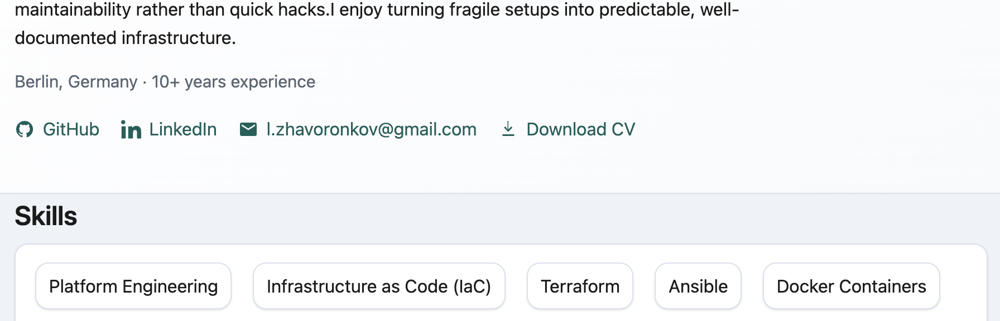

# Leonid Zhavoronkov Portfolio

Static portfolio/resume website for a Platform / DevOps Engineer.

[](https://leonid-zh.github.io/)


## Preview



## Features

- Clean single-page portfolio with semantic HTML
- Content-driven rendering from `data.json`
- Print to PDF from the header link (`window.print()` + A4 print styles)
- Mobile-friendly layout

## Tech Stack

- HTML5
- CSS3
- Vanilla JavaScript

## Run Locally

```bash
python3 -m http.server 8000
```

Open: `http://localhost:8000`

## Project Structure

- `index.html` - semantic layout with placeholders
- `styles.css` - site styling + print styles for PDF export
- `main.js` - loads `data.json` and renders page content
- `data.json` - portfolio/resume data source
- `img/preview.png` - README preview image

## Content Update

Update `data.json` to change profile text, skills, experience, education, and links.

## Deploy

Designed for GitHub Pages. Push to default branch and Pages serves `index.html`.
